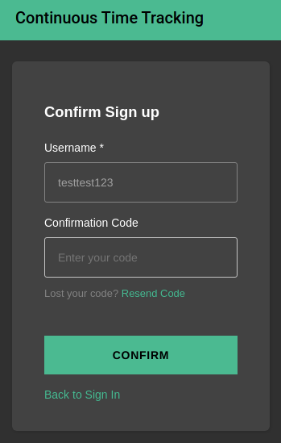

#  Continuous Time Tracking (CTT)

  > If you can’t measure it, you can’t improve it.
  
Peter Drucker

Following this principle we wanted to implement a time tracking app that forces the users to continuously track their activities throughout their day. An activity cannot be ended and therefore switching activities only works by starting a new one. This ensures that the user's activities during a day are measured without breaks which should lead to better coverage and therefore more capabilities to improve time spending.

This project was developed by four students at Munich University of Applied Science during a two weeks time frame in their fifth semester's PBLV (Praxisbegleitende Lehrveranstaltung).

By providing this application as open source, we want to enable others to use this app for themselves in order to improve their time spending. 

## Content

1. [Content](##Content)
2. [Usage](##Usage)
3. [Development Setup](##Development-Setup)  
   3.1. [Code style](###Code-style)  
   3.2. [Integration into Visual Studio Code](###Integration-into-Visual-Studio-Code)  
   3.3. [Build and serve](###Build-and-serve)  
   3.4. [Run tests](###Run-tests)
4. [Contributors](##Contributors)
5. [References](##References)

## Usage

The app is available at: http://34.202.114.178/.

The Entrypoint of the CTT is the login screen:

If you have no account, you can create an account on the create account screen:

Once you signed up, you will receive a verification email.

Type this verification code in the relating input box on the confirmation screen:

After you signed in, you will land at the home screen:

At this screen you are prompted to start a new activity.

By clicking on the hamburger menu on the left of the "Continuous Time Tracking" label you can toggle the side navigation bar:

By clicking on "Categories" you can edit all categories or create a new one.

On the edit categories screen you can edit a certain category by clicking on the pen-icon:

On the edit categories screen you can add a category py clicking on the "+":

By switching to the "History"-Tab you can view the history of the current day and step trough the days:

By clicking on your account name you can see your account details:

## Development Setup

Prerequisites:

- Node.js v10.x or later
- npm v5.x or later
- git v2.14.1 or later

Install the aws-amplify cli with (you might need <code>sudo</code>):

- <code>npm install -g @aws-amplify/cli</code>

Configure Amplify with:

- <code>amplify configure</code>
- region: us-east-1

Install Amplify libraries:

- <code>npm install --save aws-amplify @aws-amplify/ui-angular</code>

Get implemented api, database and authentication with:

- <code>amplify pull</code>

Check your Amplify status with:

- <code>amplify status</code>

### Code style

We use the default ESLint angular configuration for static code analysis.
Furthermore we use the default prettier configuration.

### Integration into Visual Studio Code

Plugins:

- Name: ESLint \
  Id: dbaeumer.vscode-eslint \
  Description: Integrates ESLint JavaScript into VS Code. \
  Version: 2.1.14 \
  Publisher: Dirk Baeumer \
  VS Marketplace Link: https://marketplace.visualstudio.com/items?itemName=dbaeumer.vscode-eslint
- Name: Prettier - Code formatter \
  Id: esbenp.prettier-vscode \
  Description: Code formatter using prettier \
  Version: 5.9.1 \
  Publisher: Prettier \
  VS Marketplace Link: https://marketplace.visualstudio.com/items?itemName=esbenp.prettier-vscode

### Build and serve

You can build and serve your local changes locally by running:

- <code>npm install</code>
- <code>ng serve</code>

in the ./ctt-frontend directory.

### Run tests

You can run the tests by running:

- <code>ng test</code>

in the ./ctt-frontend directory.

## Contributors

The following authors have contributed to this project (in alphabetical order):

- [AndHager](https://github.com/AndHager)
- [electron2302](https://github.com/electron2302)
- [sschoetz](https://github.com/sschoetz)
- [walli545](https://github.com/walli545)

## References

Useful references and and documentations we used in our project:

- [AWS Amplify](https://aws.amazon.com/de/amplify/)
- [AWS Amplify Documentation](https://docs.aws.amazon.com/amplify/)
- [Amplify Framework Documentation](https://docs.amplify.aws/)
- [Angular](https://angular.io/)
- [Angular Material](https://material.angular.io/)
